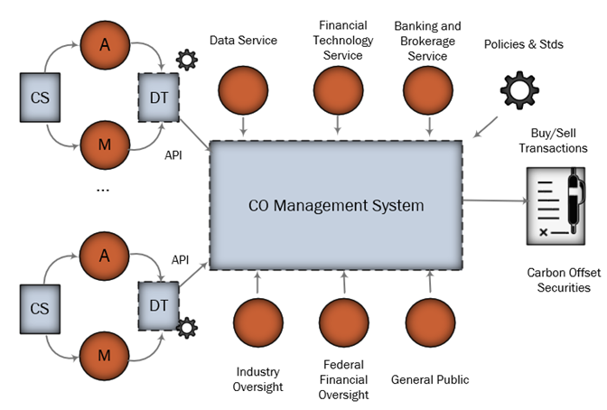
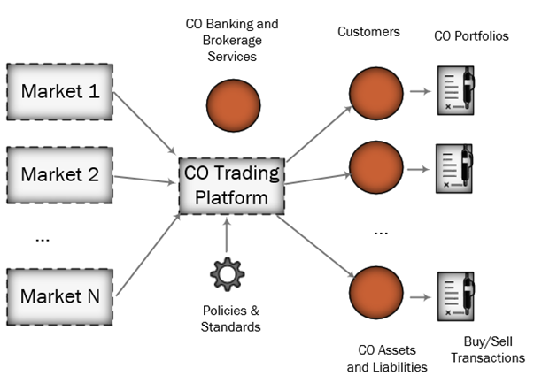
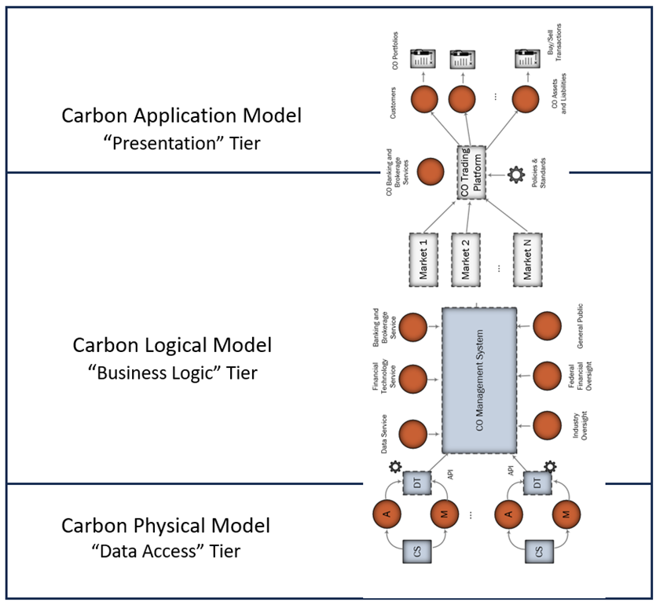

## A Vision for Global Carbon Accounting

### Introduction
SCOOP stands for Scalable Carbon Offset Open Platform.  It was initially intended as an [IT platform to support the financialization of carbon offsets]().
This initial exploration work suggested that the platform requires a flexible architecture to keep pace with the understanding of GHG dynamics. There are three fundamental issues, namely,

1. **Credibility crisis.**  Carbon offsets are going through a credibility crisis, primarily due to lack of transparency in offset supply chains.  This is not the first time or the last.  BloombergNEF is relatively [optimistic](https://www.bloomberg.com/professional/blog/long-term-carbon-offsets-outlook-2023/) on this trend.  This may not hold for the reasons below.

2. **GHG scope escapes.**  Perhaps the lack of transparency is solvable, and indeed, this was one of the initial goals for the platform. The current crisis in the carbon offsets markets points issues not only related to lack of transparency but also at some structural issues related to the accounting of the GHG Protocol scope 1, 2 and 3 emissions for an entity (company or organization).

    Scope 1 emissions, as applied to an entity represent direct emissions from operations, scope 2 are emissions from electricity and steam purchases, and scope 3 are emissions upstream and downstream the supply chains.  Today entities are not accountable for scope 3 emissions, and yet scope 3 can be as high as 80 or 90 percent of the entity's supply chain and hence carbon offsets are poor indicators and predictors for the attainment of net zero on a global basis.  Accountability for scope 3 emissions is challenging because entities do not have visibility or control over these emissions.  Issue #2 suggests an even more fundamental issue #3.

3. **Net Zero GHG accounting is incomplete regarding addition.** In practical terms, in an optimistic scenario, as more and more entities attain net zero, a portion of scope 3 emissions from one entity get internalized as scope 1 or 2 by another entity.  For instance the emissions from hydrocarbons sold by a refinery are scope 3 for that refinery.  If these hydrocarbons are burned as fuel by another entity, the emissions become scope 1 for the purchaser.  However, transporting these hydrocarbons generates more emissions, and there are additional emissions from building the transportation infrastructure. Hence, it is nearly impossible to get closure on scope 3 emissions where a portion remains orphaned and unclaimed.  Since emissions are liabilities, actors have an economic incentive to ignore them unless they are bound by specific obligations.  

    This dynamic was noted by [Alicia Seiger][Seiger].  From this reasoning, it follows that even if every organization in the world reaches net zero does not guarantee that global net zero has been achieved, suggesting some fundamental flaws with the concept of carbon offsets.

If we acknowledge that the concept of carbon offsets will be in flux for the foreseeable future, it does not mean that the development work around carbon the original platform definition needs to be discarded, or that a start from scratch will be necessary at some point to factor in the evolution of carbon accounting concepts.  It the platform architecture has enough resiliency, it may be possible to evolve it and update it over time without costly reengineering, using well-known software engineering principles.

Kumar Venkat has proposed that one possible method to tighten up carbon accounting is to carry out carbon accounting at the [industry sector level](https://illuminem.com/illuminemvoices/to-decarbonize-focus-on-sectors-rather-than-companies).  The promise of this approach is to provide the means to internalize at least some of the emissions currently treated as scope 3, generally treated as not accountable emissions.

### Generalized Carbon Accounting Platform 
The development for this initiative is being carried out under the code name SCOOP, for Scalable or Sectoral COOP, where COOP comprises an earlier proposal for a carbon offset accounting system initially targeted for FinTech applications.  COOP stands for Carbon Offset Open Platform.

SCOOP cannot be, out of necessity, a single architecture.  Rather, it is template or framework functioning as an architecture generator.  Each architecture instance is optimized for a specific industry sector.  This architecture is an instance of SCOOP that in turn becomes a tool to generate solution instances for that sector.

The first implementations will be generated or compiled manually, but as methodologies mature, opportunities open up to apply automation, with the help of AI engines to assemble and maintain solution instances, taking into account commonality within an industry sector.

There are necessary architecture goals that SCOOP must meet along at least five categories to be useful and effective, described in Table 1.  Starting from the top, SCOOP instances can potentially support multiple applications, some of which do not exist today.  For instance, carbon offset accounting is an important instance of carbon accounting as practiced today.  Carbon offsets come with significant flaws in terms of transparency, trust, and attestation, to the point that this concept may evolve or get replaced eventually.  The replacement will still contain elements of the original offset.  Such a change forcing a fundamental retooling of a SCOOP solution instead of proportionally incremental modification would be undesirable.  Likewise, a SCOOP solution supports multiple interfaces, both human interfaces and APIs for integration into other applications in a modular application network.  APIs can also be used to integrate SCOOP peers into larger entities and to carry out settlements for scope 1, 2 and 3 emissions.
A SCOOP system can keep track of both carbon capture and emissions within a supply chain or lifecycle, as well as the different flavors of GHG mitigation such as emissions avoidance vs. removals, risk assessments for carbon tranches, and permanency assessments based on storage modalities. FinTech and carbon securities represent another application where a carbon offset or credit system is integrated into existing financial trading systems.

A SCOOP model incorporates capabilities to explicitly identify and quantify scope 3 targets that can be internalized into scope 1 or 2 from interactions within the entities in an industry segment.  These interactions take place when a new entity is integrated into the model as well as during operations.

A SCOOP system must be scalable over every metric relevant to an application.  The human interface must support access by individuals, where these individuals may be from cohorts varying in size from a few dozen to millions.  Calls to APIs must satisfy latency and throughput performance as required by an application.  Solutions for a particular industry can be cloned to represent individual participants within the industry, and orchestrated action across all instances within an industry should be possible.  This makes possible calculating country-wide net zero assessments across an entire industry segment.

_Table 1.  SCOOP Objectives_

|Requirements       | Remarks|
|--                 |-- |
|Applications       |Carbon Accounting for both Capture _and_ emissions |
|                   |Carbon offset Accounting  |
|                   |Scope 1, 2 and 3 Emissions Monitoring |
|                   |Bringing Trust to FinTech and Carbon Securities|
|||
|Scalability        |Integration Paths for|
|                   |&nbsp;&nbsp;> Single-application Instances to Whole Industry Segments |
|                   |&nbsp;&nbsp;> Single Users to Local and Global Communities         |
|                   |&nbsp;&nbsp;> Single Companies or Organizations to Industry Sectors to UNFCC Nationally Determined Contributions (NDCs)|
||
|Capabilities       |Open-ended Multi-application Environment             |
|                   |Continuous, Real-time Auditable, Traceable Carbon Assets|
|                   |Integration Hooks for Regulatory Standards and Agencies|
|                   |Extensible Framework to other GHGs beyond CO2|
|| Scope 3 internalization through sectoral approach|
||
|Software Architecture|Enterprise 3-tier Architecture Patterns|
|                   |Cloud-based Service Ecosystem with 100s or 1,000s of Participants|
|                   |Networks of Collaborating Independent Service Providers|
|                   |Open-Source Project (starting git/mkdocs repository)|
||
|Foundation Technologies | Digital Twins; Internet of Things; NoSQL; LoRa; GIS; Blockchain Secure Ledgers; Artificial Intelligence; Financial, Cybersecurity, Privacy and Regulatory Standards
||

A goal for SCOOP is to generalize the original COOP architecture to encompass an industry sector without significant rework.  Let's call this new scheme scaled COOP, or simply SCOOP.  COOP models a single supply chain, from digital twin to financial market offerings. SCOOP becomes an IT carbon accounting platform, much larger in scope, with dozens, possibly hundreds of digital twin models representing a cross section of the target industry, with potentially multiple applications.  COOP is still there, as a particular case.
The SCOOP architecture represents a trivial modification to the original COOP architecture.  Let's start with the original COOP architecture, shown in Figure 1.

*Figure 1. Original COOP architecture.*

The carbon offset securities delivered from this system are traded through a fintech app, shown in Figure 2.

*Figure 2. Carbon offset trading app.*
Now let's turn Figure 1 and Figure 2 on their side to form an application stack, shown in Figure 3.

*Figure 3. Carbon offset application stack.*
Figure 3 represents a fintech carbon offset ecosystem dedicated to the trading of carbon offset securities.  Also note how this structure resembles that of a traditional 3-tier architecture for an enterprise Web application.  This is an example of a SCOOP application.  SCOOP need not be circumscribed to fintech applications.  It might be possible to tally up the set of UNFCCC Nationally Determined Contributions (NDCs) to emissions reductions for a particular country.  The scale for such an application would be enormous; a carbon offset accounting app for offset trading may encompass a handful of carbon capture suppliers and consumers.  An NDC app might comprise several thousand, representing one or more industry sectors or even countries.

*Figure 4. SCOOP industry sector ecosystem.*
 

[Seiger]: T. Heller, A. Seiger, Settling Climate Accounts: Navigating the Road to Net Zero, ISBN 978-3030836498, Palgrave Macmillan (October 21, 2021)

