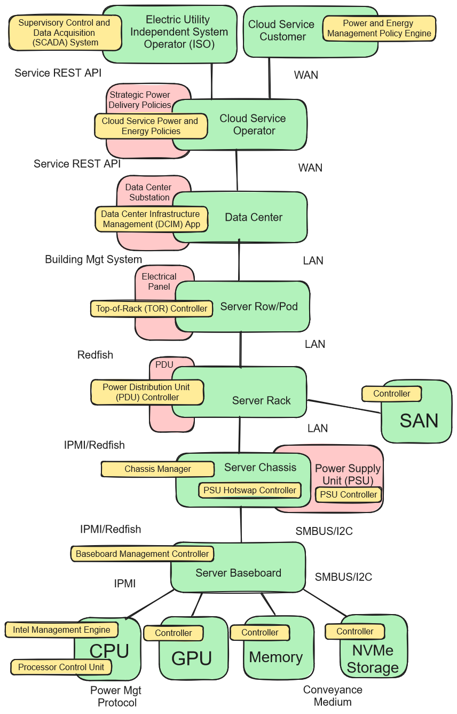

Jose has very timely written an example of how power readings can be extracted from a server.  Attached is the bash script and the output of a sample run.

 

The underlying method is the Intel RAPL technology (Running Average Power Limit) technology.  RAPL can be used to limit power consumption by a CPU by changing the CPU frequency.  To figure out how much to throttle it is necessary to know the CPU’s power consumption.  The CPU provides this figure through a machine status register (MSR).  A SCOOP digital twin can sample this number by taking a reading of the MSR.

 

It takes some work to achieve this.  A power reading is a system call provided through a hardware-specific kernel module.  There are additional complications:  Each CPU in a server needs to be sampled individually.  Some of this complexity can be abstracted by using higher level components.  For instance, the Intel Node Manager firmware running in the PCH or the CPU itself (IPMI over I2C or the network) and the BMC firmware provided by the motherboard manufacturer (IPMI or Redfish calls).

 

Furthermore, this number tells only part of the story.  The power consumption by other entities still needs to be accounted for, including memory, GPUs, motherboard components and power supply losses.  This is complicated.  My recommendation is that we would do this work in depth for a specific customer as part of a paid consulting gig or through a research grant.  Another challenge is to apportion this power consumption to VMs in a multitenant data center environment.   For simplicity and the purposes of the PoC we will build a simple synthetic model in Python.

